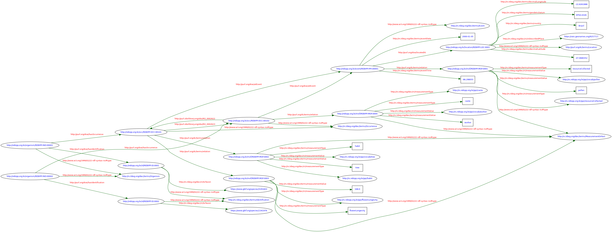

# Darwin Core RDF guide

Title
: Plant-Pollinator Interactions Vocabulary RDF guide

Date version issued
: 2021-12-03

Date created
: 2021-12-03

Part of Standard
: <http://www.rebipp.org.br/standards/ppi/>

This version
: <http://rs.rebipp.org.br/ppi/terms/guides/rdf/2021-12-03>

Latest version
: <http://rs.rebipp.org.br/ppi/terms/guides/rdf>

Previous version
: <http://rs.rebipp.org.br/ppi/terms/guides/rdf/2021-12-03>

Abstract
: This guide is intended to facilitate the use of Plant-Pollinator Interactions Vocabulary terms in the Resource Description Framework (RDF). It explains basic features of RDF and provides details of how to expose data in the form of RDF using [Darwin Core terms](https://dwc.tdwg.org/terms/) and terms from other key vocabularies.

Contributors
: Jose A Salim (Universidade de São Paulo), Paula Zermoglio (Universidad de Buenos Aires), Debora P Drucker (Embrapa Agricultura Digital), Filipi Soares (Universidade de São Paulo), Antonio M Saraiva (Universidade de São Paulo)

Creator
: REBIPP Maintenance Group

Bibliographic citation
: REBIPP Maintenance Group. 2021. Plant-Pollinator Interactions RDF guide. Brazilian Network on Plant-Pollinator Interactions (REBIPP). <http://rs.rebipp.org.br/ppi/terms/guides/rdf/2021-12-03>

## 1 Introduction (non-normative)

This is the guide for encoding biodiversity data using the [Resource Description Framework](http://www.w3.org/TR/rdf11-concepts/).

The Plant-Pollinator Interactions Vocabulary RDF Guide is targeted toward those who wish to share plant-pollinator interactions data described by Darwin Core (DwC) properties using RDF. It describes how community best practices for expressing fundamental information about resources using RDF relate to Darwin Core terms, and clarifies how Darwin Core terms should be used in RDF with literal (string) and non-literal (IRI reference) objects. It is not intended to explain the model and syntax of RDF. For a general introduction to RDF in a biodiversity context, see the [Beginner's Guide to RDF](https://github.com/tdwg/rdf/blob/master/Beginners.md). For a more detailed introduction to RDF, see the [RDF Primer](http://www.w3.org/TR/rdf11-primer/).

### 1.1 Status of the content of this document

Sections of this document are explicitly identified as either normative or non-normative. All numbered examples are non-normative, even if they fall within sections designated as normative. Tables may be designated as non-normative, even if they fall within sections designated as normative.

#### 1.1.1 RFC 2119 key words

The key words “MUST”, “MUST NOT”, “REQUIRED”, “SHALL”, “SHALL NOT”, “SHOULD”, “SHOULD NOT”, “RECOMMENDED”, “MAY”, and “OPTIONAL” in this document are to be interpreted as described in [RFC 2119](https://tools.ietf.org/html/rfc2119).

### 1.2 Features of RDF (non-normative)

This section describes some of the basic features of RDF. It is not intended as a tutorial on RDF, but rather to provide enough information about the features of RDF to explain why specific guidelines for the use of Plant-Pollinator Interactions Vocabulary in RDF are necessary and why an additional [Darwin Semantic Web](http://purl.org/dsw/) namespace is necessary.


### 1.3 Use of terms in RDF

#### 1.3.1 Well-known vocabularies (non-normative)

Because RDF assumes no pre-existing agreement between data providers and consumers about the terms used as properties to describe resources, the likelihood that a consuming client will "understand" the meaning of an RDF triple will be increased if the provider uses terms from a well-known vocabulary. Some well-known general and biodiversity-related vocabularies are listed in the [Introduction to the Beginner's Guide to RDF](https://github.com/tdwg/rdf/blob/master/Beginners.md#037-biodiversity-related-and-general-vocabularies-and-ontologies). If no well-known term exists to represent a property needed to describe a resource, a data provider MAY "mint" its own term. In that case, the provider SHOULD assign the term an IRI, define the term in RDF, provide clear human-understandable documentation of how the term should be used, provide for dereferencing of the IRI, and commit to the long-term stability of the term IRI and definition.

#### 1.3.2 Use of Darwin Core dwc:ResourceRelationship class in RDF (normative)

Due RDF can naturally handle relationship between resources, the `dwc:ResourceRelationship` class does not make sense in the RDF world. However, the **direction** and the **type** of an interaction MUST be documented using a different approach.

#### 1.4.4 Limitations of this guide (non-normative)

This guide provides general guidance about how Plant-Pollinator Interactions Vocabulary terms can be used in conjunction with Darwin Core standard to document plant-pollinator interactions as RDF predicates.

It is not intend to be a guide for how to use Darwin Core in RDF. For detailed guide in how Darwin Core can be used in the context of RDF see [Darwin Core RDF guide][http://rs.tdwg.org/dwc/terms/guides/rdf/].


## 2 Implementation guide

### 2.1 Definitions

#### 2.1.1 Namespace abbreviations used in XML qualified names (QNames) in this document (non-normative)

**Table 1**

vocabulary name | namespace abbreviation | full prefix
--- | --- | ---
Resource Description Framework | rdf: | <http://www.w3.org/1999/02/22-rdf-syntax-ns#>
RDF Schema | rdfs: | <http://www.w3.org/2000/01/rdf-schema#>
XML Schema | xsd: | <http://www.w3.org/2001/XMLSchema#>
Web Ontology Language | owl: | <http://www.w3.org/2002/07/owl#>
Darwin Core terms (string literal objects) | dwc: | <http://rs.tdwg.org/dwc/terms/>
Darwin Core terms (IRI reference objects) | dwciri: | <http://rs.tdwg.org/dwc/iri/>
Dublin Core terms | dcterms: | <http://purl.org/dc/terms/>
Dublin Core legacy terms | dc: | <http://purl.org/dc/elements/1.1/>
Dublin Core type vocabulary | dcmitype: | <http://purl.org/dc/dcmitype/>
Darwin Semantic Wev | dws: | <http://purl.org/dsw/>
Plant-Pollinator Interactions Vocabulary | ppi: | <http://rs.rebipp.org.br/ppi/terms/>
Relation Ontology | ro: | <http://purl.obolibrary.org/obo/>

For brevity, the examples do not include namespace declarations, nor an `rdf:RDF` container element.

#### 2.1.2 Generating graphical diagrams and triple tables for the examples (non-normative)

The [W3C RDF Validation Service](http://www.w3.org/RDF/Validator/) can be used to generate both a tabular listing and a graphical diagram of the triples that are included in the example XML serializations. Text from the examples can be placed inside the `rdf:RDF` container element below, then pasted into the validator box to generate the desired output.

```xml
<?xml version="1.0" encoding="UTF-8"?>
<rdf:RDF  xmlns:rdf="http://www.w3.org/1999/02/22-rdf-syntax-ns#"
xmlns:rdfs="http://www.w3.org/2000/01/rdf-schema#"
xmlns:xsd="http://www.w3.org/2001/XMLSchema#"
xmlns:owl="http://www.w3.org/2002/07/owl#"
xmlns:dwc="http://rs.tdwg.org/dwc/terms/"
xmlns:dwciri="http://rs.tdwg.org/dwc/iri/"
xmlns:dcterms="http://purl.org/dc/terms/"
xmlns:dc="http://purl.org/dc/elements/1.1/"
xmlns:dcmitype="http://purl.org/dc/dcmitype/"
xmlns:dsw="http://purl.org/dsw/"
xmlns:ppi="http://rs.rebipp.org.br/ppi/terms/"
xmlns:ro="<http://purl.obolibrary.org/obo/>"
>
… resource descriptions go here …
</rdf:RDF>
```

### 2.2 Repreting interactions between dwc:Occurrences

In RDF,  in contrast to text and XML representations, the interactions are represented using the [Relation Ontology](http://purl.obolibrary.org/obo/) terms as predicate of the triples: `(a dwc:Occurrence) -> [RO:XXXX] -> (a dwc:Occurrence)`, where *RO:XXXX* is the URI of a term in Relation Ontology.

Since, there is no specific term in the `dwc:` or `dwciri:` namespaces to represent an biologial interaction, and the aim of this guide it not to extend the Darwin Core Standard with new terms, this is the most appropriated way to represent any kind of biological interactions between resources.

**Note**: the usage of Relation Ontology is a recommendation, not been mandatory to represent interactions. Other ontologies and vocabularies MAY be used to represent the interactions, the only requirement is the terms used as predicates follow the RDF definitions.

### 2.3. Example of an interaction in RDF (non-normative)

The following example shows how an interaction between two arbitrary `dwc:Occurrence` instances can be documented in RDF. In the example bellow the interaction between the occurrences `http://rebipp.org.br/occ/REBIPP:OCC:00101` and `http://rebipp.org.br/occ/REBIPP:OCC:00102` is documented in the both directions (ie. ro:RO_0002623, "has flowers visited by" and RO_0002622, "visits flowers of"). Until is it not mandatory to include the both triples in RDF, it is recommended, since some terms in the selected ontology or vocabulary may not have defined the inverse property for its terms.

```turtle
@prefix rdf: <http://www.w3.org/1999/02/22-rdf-syntax-ns#>.
@prefix xsd: <http://www.w3.org/2001/XMLSchema#>.
@prefix dwc: <http://rs.tdwg.org/dwc/terms/>.
@prefix ro:  <http://purl.obolibrary.org/obo/>.

<http://rebipp.org.br/occ/REBIPP:OCC:00101>
   a dwc:Occurrence;
   ro:RO_0002623 <http://rebipp.org.br/occ/REBIPP:OCC:00102>.

<http://rebipp.org.br/occ/REBIPP:OCC:00102>
   a dwc:Occurrence;
   ro:RO_0002622 <http://rebipp.org.br/occ/REBIPP:OCC:00101>.
```

### 2.4 The Plant-Pollinator Interaction Vocabulary and the dwc:MeasurementOrFact

In order to associated the terms in the PPI Vocabulary to instances of `dwc:Occurrence` and `dwc:Event` classes, the `dwc:MeasurementOrFact` class MUST be used. The RDF triples documenting the associations MUST use the term `dcterms:relation` as predicate of the triple having an instance of the `dwc:Occurrence` or `dwc:Event` as subject and an instance `dwc:MeasurementOrFact` as the object.

### 2.5 Example of using PPI terms in RDF (non-normative)

The example bellow shows how to use many different PPI terms in conjunction with `dwc:MeasurementOrFact` class and `dcterms:relation` term to document interactions outcomes and organisms traits. in the example the instance of `dwc:Event` class (i.e. `http://rebipp.org.br/event/REBIPP:PPI:00001`) represents an interaction event in which a pollen as collected. Additionally, the two instances of `dwc:Occurrence` class are associated with different instances of `dwc:MeasurementOrFact` class (ie. the habit of the plant and the flower longevity, and the caste of the bee represented in the occurrunce).

```turtle
@prefix rdf: <http://www.w3.org/1999/02/22-rdf-syntax-ns#>.
@prefix xsd: <http://www.w3.org/2001/XMLSchema#>.
@prefix dcterms: <http://purl.org/dc/terms/>.
@prefix dwc: <http://rs.tdwg.org/dwc/terms/>.
@prefix dwciri: <http://rs.tdwg.org/dwc/iri/>.
@prefix dsw: <http://purl.org/dsw/>.
@prefix ro:  <http://purl.obolibrary.org/obo/>.

<http://rebipp.org.br/event/REBIPP:PPI:00001>
    a dwc:Event;
    dwc:eventDate "2000-01-05"^^xsd:dateTime;
    dwc:eventTime "-86.298055"^^xsd:dateTime;
    dcterms:relation <http://rebipp.org.br/mof/REBIPP:MOF:0001>.

<http://rebipp.org.br/occ/REBIPP:OCC:00101>
   a dwc:Occurrence;
   dsw:atEvent <http://rebipp.org.br/event/REBIPP:PPI:00001>;
   dcterms:relation <http://rebipp.org.br/mof/REBIPP:MOF:0002>;
   dcterms:relation <http://rebipp.org.br/mof/REBIPP:MOF:0003>;
   ro:RO_0002623 <http://rebipp.org.br/occ/REBIPP:OCC:00102>.

<http://rebipp.org.br/occ/REBIPP:OCC:00102>
   a dwc:Occurrence;
   dsw:atEvent <http://rebipp.org.br/event/REBIPP:PPI:00001>;
   dcterms:relation <http://rebipp.org.br/mof/REBIPP:MOF:0004>;
   ro:RO_0002622 <http://rebipp.org.br/occ/REBIPP:OCC:00101>.

<http://rebipp.org.br/mof/REBIPP:MOF:0001>
   a dwc:MeasurementOrFact;
   dwciri:measurementType <http://rs.rebipp.org.br/ppi/terms/resourceCollected>;
   dwc:measurementType "resourceCollected"^^xsd:string;
   dwc:measurementValue "pollen"^^xsd:string.

<http://rebipp.org.br/mof/REBIPP:MOF:0002>
   a dwc:MeasurementOrFact;
   dwciri:measurementType <http://rs.rebipp.org.br/ppi/terms/habit>;
   dwc:measurementType "habit"^^xsd:string;
   dwciri:measurementValue <http://purl.obolibrary.org/obo/FLOPO_0900033>;
   dwc:measurementValue "whole plant arborescent"^^xsd:string.

<http://rebipp.org.br/mof/REBIPP:MOF:0003>
   a dwc:MeasurementOrFact;
   dwciri:measurementType <http://rs.rebipp.org.br/ppi/terms/flowerLongevity>;
   dwc:measurementType "flowerLongevity"^^xsd:string;
   dwc:measurementValue "168"^^xsd:decimal.

<http://rebipp.org.br/mof/REBIPP:MOF:0004>
   a dwc:MeasurementOrFact;
   dwciri:measurementType <http://rs.rebipp.org.br/ppi/terms/caste>;
   dwc:measurementType "caste"^^xsd:string;
   dwc:measurementValue "worker"^^xsd:string.
```

### 2.6 A complete example (non-normative)

In [Terse RDF Triple Language (Turtle)](http://www.w3.org/TR/turtle/) syntax:

```turtle
@prefix rdf: <http://www.w3.org/1999/02/22-rdf-syntax-ns#>.
@prefix xsd: <http://www.w3.org/2001/XMLSchema#>.
@prefix dcterms: <http://purl.org/dc/terms/>.
@prefix dwc: <http://rs.tdwg.org/dwc/terms/>.
@prefix dwciri: <http://rs.tdwg.org/dwc/iri/>.
@prefix dsw: <http://purl.org/dsw/>.
@prefix ro:  <http://purl.obolibrary.org/obo/>.

<http://rebipp.org.br/event/REBIPP:PPI:00001>
    a dwc:Event;
    dwc:eventDate "2000-01-05"^^xsd:dateTime;
    dwc:eventTime "-86.298055"^^xsd:dateTime;
    dsw:locatedAt <http://rebipp.org.br/location/REBIPP:LOC:0001>;
    dcterms:relation <http://rebipp.org.br/mof/REBIPP:MOF:0001>.

<http://rebipp.org.br/location/REBIPP:LOC:0001>
    a dcterms:Location;
    dwc:decimalLatitude "-47.0680352"^^xsd:decimal;
    dwc:decimalLongitude "-22.8261888"^^xsd:decimal;
    dwc:geodeticDatum "EPSG:4326";
    dwc:country "Brazil";
    dwciri:inDescribedPlace <https://sws.geonames.org/9257717>.

<http://rebipp.org.br/organism/REBIPP:IND:00001>
    a dwc:Organism;
    dsw:hasOccurrence <http://rebipp.org.br/occ/REBIPP:OCC:00101>;
    dsw:hasIdentification <http://rebipp.org.br/id/REBIPP:ID:0001>.

<http://rebipp.org.br/organism/REBIPP:IND:00002>
    a dwc:Organism;
    dsw:hasOccurrence <http://rebipp.org.br/occ/REBIPP:OCC:00102>;
    dsw:hasIdentification <http://rebipp.org.br/id/REBIPP:ID:0002>.

<http://rebipp.org.br/occ/REBIPP:OCC:00101>
   a dwc:Occurrence;
   dsw:atEvent <http://rebipp.org.br/event/REBIPP:PPI:00001>;
   dcterms:relation <http://rebipp.org.br/mof/REBIPP:MOF:0002>;
   dcterms:relation <http://rebipp.org.br/mof/REBIPP:MOF:0003>;
   ro:RO_0002623 <http://rebipp.org.br/occ/REBIPP:OCC:00102>.

<http://rebipp.org.br/occ/REBIPP:OCC:00102>
   a dwc:Occurrence;
   dsw:atEvent <http://rebipp.org.br/event/REBIPP:PPI:00001>;
   dcterms:relation <http://rebipp.org.br/mof/REBIPP:MOF:0004>;
   ro:RO_0002622 <http://rebipp.org.br/occ/REBIPP:OCC:00101>.

<http://rebipp.org.br/id/REBIPP:ID:0001>
   a dwc:Identification;
   dwciri:toTaxon <https://www.gbif.org/species/5293403>.

<http://rebipp.org.br/id/REBIPP:ID:0002>
   a dwc:Identification;
   dwciri:toTaxon <https://www.gbif.org/species/1341976>.

<http://rebipp.org.br/mof/REBIPP:MOF:0001>
   a dwc:MeasurementOrFact;
   dwciri:measurementType <http://rs.rebipp.org.br/ppi/terms/resourceCollected>;
   dwc:measurementType "resourceCollected"^^xsd:string;
   dwc:measurementValue "pollen"^^xsd:string.

<http://rebipp.org.br/mof/REBIPP:MOF:0002>
   a dwc:MeasurementOrFact;
   dwciri:measurementType <http://rs.rebipp.org.br/ppi/terms/habit>;
   dwc:measurementType "habit"^^xsd:string;
   dwciri:measurementValue <http://purl.obolibrary.org/obo/FLOPO_0900033>;
   dwc:measurementValue "whole plant arborescent"^^xsd:string.

<http://rebipp.org.br/mof/REBIPP:MOF:0003>
   a dwc:MeasurementOrFact;
   dwciri:measurementType <http://rs.rebipp.org.br/ppi/terms/flowerLongevity>;
   dwc:measurementType "flowerLongevity"^^xsd:string;
   dwc:measurementValue "168"^^xsd:decimal.

<http://rebipp.org.br/mof/REBIPP:MOF:0004>
   a dwc:MeasurementOrFact;
   dwciri:measurementType <http://rs.rebipp.org.br/ppi/caste>;
   dwc:measurementType "caste"^^xsd:string;
   dwc:measurementValue "worker"^^xsd:string.
```

Here a graph in [RDF/XML syntax](http://www.w3.org/TR/rdf-syntax-grammar/):

```xml
<?xml version="1.0" encoding="utf-8" ?>
<rdf:RDF xmlns:rdf="http://www.w3.org/1999/02/22-rdf-syntax-ns#"
         xmlns:dwc="http://rs.tdwg.org/dwc/terms/"
         xmlns:dsw="http://purl.org/dsw/"
         xmlns:dc="http://purl.org/dc/terms/"
         xmlns:dwciri="http://rs.tdwg.org/dwc/iri/"
         xmlns:ro="http://purl.obolibrary.org/obo/">

  <rdf:Description rdf:about="http://rebipp.org.br/event/REBIPP:PPI:00001">
    <rdf:type rdf:resource="http://rs.tdwg.org/dwc/terms/Event"/>
    <dwc:eventDate rdf:datatype="http://www.w3.org/2001/XMLSchema#dateTime">2000-01-05</dwc:eventDate>
    <dwc:eventTime rdf:datatype="http://www.w3.org/2001/XMLSchema#dateTime">-86.298055</dwc:eventTime>
    <dsw:locatedAt>
      <dc:Location rdf:about="http://rebipp.org.br/location/REBIPP:LOC:0001">
        <dwc:decimalLatitude rdf:datatype="http://www.w3.org/2001/XMLSchema#decimal">-47.0680352</dwc:decimalLatitude>
        <dwc:decimalLongitude rdf:datatype="http://www.w3.org/2001/XMLSchema#decimal">-22.8261888</dwc:decimalLongitude>
        <dwc:geodeticDatum>EPSG:4326</dwc:geodeticDatum>
        <dwc:country>Brazil</dwc:country>
        <dwciri:inDescribedPlace rdf:resource="https://sws.geonames.org/9257717"/>
      </dc:Location>
    </dsw:locatedAt>

    <dc:relation>
      <dwc:MeasurementOrFact rdf:about="http://rebipp.org.br/mof/REBIPP:MOF:0001">
        <dwciri:measurementType rdf:resource="http://rs.rebipp.org.br/ppi/resourceCollected"/>
        <dwc:measurementType rdf:datatype="http://www.w3.org/2001/XMLSchema#string">resourceCollected</dwc:measurementType>
        <dwciri:measurementValue rdf:resource="http://rs.rebipp.org.br/ppi/vocab/pollen"/>
        <dwc:measurementValue rdf:datatype="http://www.w3.org/2001/XMLSchema#string">pollen</dwc:measurementValue>
      </dwc:MeasurementOrFact>
    </dc:relation>

  </rdf:Description>

  <dwc:Organism rdf:about="http://rebipp.org.br/organism/REBIPP:IND:00001">
    <dsw:hasOccurrence rdf:resource="http://rebipp.org.br/occ/REBIPP:OCC:00101"/>
    <dsw:hasIdentification>
      <dwc:Identification rdf:about="http://rebipp.org.br/id/REBIPP:ID:0001">
        <dwciri:toTaxon rdf:resource="https://www.gbif.org/species/5293403"/>
      </dwc:Identification>
    </dsw:hasIdentification>

  </dwc:Organism>

  <dwc:Organism rdf:about="http://rebipp.org.br/organism/REBIPP:IND:00002">
    <dsw:hasOccurrence rdf:resource="http://rebipp.org.br/occ/REBIPP:OCC:00102"/>
    <dsw:hasIdentification>
      <dwc:Identification rdf:about="http://rebipp.org.br/id/REBIPP:ID:0002">
        <dwciri:toTaxon rdf:resource="https://www.gbif.org/species/1341976"/>
      </dwc:Identification>
    </dsw:hasIdentification>

  </dwc:Organism>

  <dwc:Occurrence rdf:about="http://rebipp.org.br/occ/REBIPP:OCC:00101">
    <dsw:atEvent rdf:resource="http://rebipp.org.br/event/REBIPP:PPI:00001"/>
    <dc:relation>
      <dwc:MeasurementOrFact rdf:about="http://rebipp.org.br/mof/REBIPP:MOF:0002">
        <dwciri:measurementType rdf:resource="http://rs.rebipp.org.br/ppi/terms/habit"/>
        <dwc:measurementType rdf:datatype="http://www.w3.org/2001/XMLSchema#string">habit</dwc:measurementType>
        <dwciri:measurementValue rdf:resource="http://purl.obolibrary.org/obo/FLOPO_0900033"/>
        <dwc:measurementValue rdf:datatype="http://www.w3.org/2001/XMLSchema#string">whole plant arborescent</dwc:measurementValue>
      </dwc:MeasurementOrFact>
    </dc:relation>

    <dc:relation>
      <dwc:MeasurementOrFact rdf:about="http://rebipp.org.br/mof/REBIPP:MOF:0003">
        <dwciri:measurementType rdf:resource="http://rs.rebipp.org.br/ppi/terms/flowerLongevity"/>
        <dwc:measurementType rdf:datatype="http://www.w3.org/2001/XMLSchema#string">flowerLongevity</dwc:measurementType>
        <dwc:measurementValue rdf:datatype="http://www.w3.org/2001/XMLSchema#decimal">168.0</dwc:measurementValue>
      </dwc:MeasurementOrFact>
    </dc:relation>

    <ro:RO_0002623 rdf:resource="http://rebipp.org.br/occ/REBIPP:OCC:00102"/>
  </dwc:Occurrence>

  <dwc:Occurrence rdf:about="http://rebipp.org.br/occ/REBIPP:OCC:00102">
    <dsw:atEvent rdf:resource="http://rebipp.org.br/event/REBIPP:PPI:00001"/>
    <dc:relation>
      <dwc:MeasurementOrFact rdf:about="http://rebipp.org.br/mof/REBIPP:MOF:0004">
        <dwciri:measurementType rdf:resource="http://rs.rebipp.org.br/ppi/terms/caste"/>
        <dwc:measurementType rdf:datatype="http://www.w3.org/2001/XMLSchema#string">caste</dwc:measurementType>
        <dwc:measurementValue rdf:datatype="http://www.w3.org/2001/XMLSchema#string">worker</dwc:measurementValue>
      </dwc:MeasurementOrFact>
    </dc:relation>

    <ro:RO_0002622 rdf:resource="http://rebipp.org.br/occ/REBIPP:OCC:00101"/>
  </dwc:Occurrence>
</rdf:RDF>
```

Here is the an image depicting the graph definied above:


<a href="example_rdf.png" target="_blank"></a>